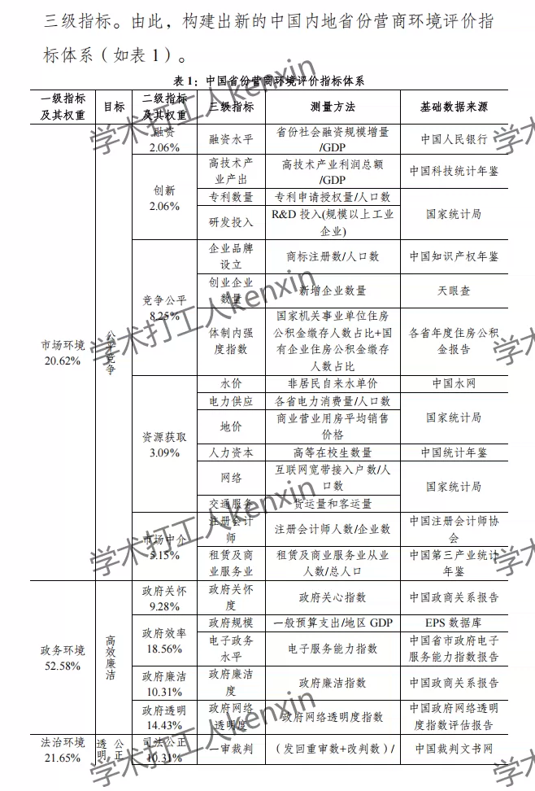
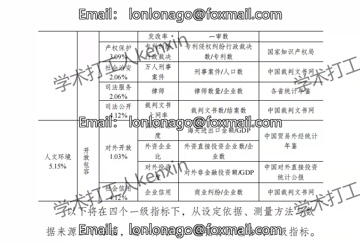
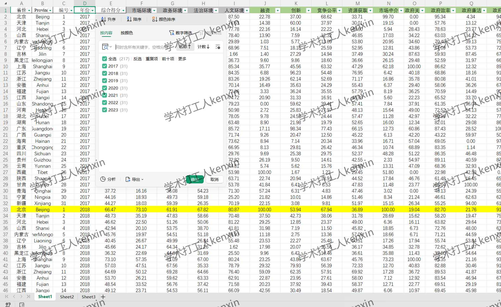

## Body

"China Province Business Environment Assessment Database 2025" [2017-2023/Provincial Business Environment]

The annual business environment data of 31 provinces in mainland China from 2017 to 2023, including the total index of business environment, scores for four primary indicators, and scores for 16 secondary indicators.

## Images

Here is a pay link on Stripe ( https://buy.stripe.com/3cs8yP7sY87d0vu9AB ). Please contact me lonlonago@foxmail.com after funding $89, and I will send you a complete data files , thank you!

